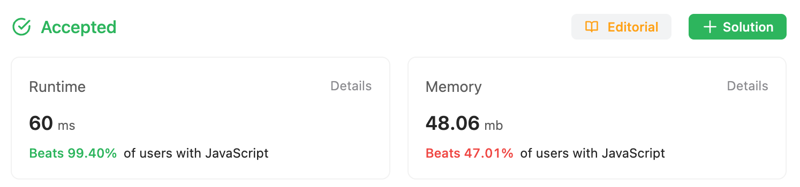

2023-08-02

## Problem

https://leetcode.com/problems/longest-substring-without-repeating-characters/

Given a string **s**, find the length of the **longest** **substring** without repeating characters.

**Example 1:**

```
Input: s = "abcabcbb"
Output: 3
Explanation: The answer is "abc", with the length of 3.
```

**Example 2:**

```
Input: s = "bbbbb"
Output: 1
Explanation: The answer is "b", with the length of 1.
```

**Example 3:**

```
Input: s = "pwwkew"
Output: 3
Explanation: The answer is "wke", with the length of 3.
Notice that the answer must be a substring, "pwke" is a subsequence and not a substring.
```

**Constraints:**

- **0 <= s.length <= 5 \* 104**

- **s** consists of English letters, digits, symbols, and spaces.

## Solution

<p style="text-align: center;">Note: Both Solution use Sliding Window</p>

### My Original Solution

This is the Sliding Window Algorithm. But, the Time complexity is $O(n^2)$.

It's because I used Array.includes(), Array.indexOf() method And their time complexity of these methods is already _O_(_n_).

And this solution already loops through all characters with Sliding Window Algorithm.
Therefore, the overall time complexity becomes $O(n^2)$.

Here is the code I used:

```javascript
const lengthOfLongestSubstring = function (s) {
  let streak = 0;
  let arr = [];

  for (let i = 0; i < s.length; i++) {
    const c = s[i];
    if (arr.includes(c)) {
      arr = arr.slice(arr.indexOf(c) + 1);
    }
    arr.push(c);
    streak = Math.max(streak, arr.length);
  }
  if (streak === 0) {
    return s.length;
  }
  return streak;
};
```



This is quite fast and simple code.

1. I initialize two variables:

   **streak**: an integer to keep track of the maximum length of non-repeating character sequence found so far.
   **arr**: an array to store the current sequence of non-repeating characters,

2. loop through characters, add to **arr**. and update **streak**
3. If there is already the same character in **arr**, remove characters from the beginning up to and including the repeating character **c**, effectively starting a new sequence of non-repeating characters.
4. I add the last condition(**streak** === 0) for s = " " case. The answer should be 1 in this case.

### Improved Solution, Using Map.

This solution use map to enhance Time Complexity.

https://leetcode.com/problems/longest-substring-without-repeating-characters/submissions/

```javascript
var lengthOfLongestSubstring = function (s) {
  const seen = new Map();
  let start = 0;
  let maxLen = 0;

  for (let i = 0; i < s.length; i++) {
    if (seen.has(s[i])) start = Math.max(seen.get(s[i]) + 1, start);
    seen.set(s[i], i);
    maxLen = Math.max(i - start + 1, maxLen);
  }

  return maxLen;
};
```


This solution use Map(). And time complexity is $O(n)$.

## What I Learned

The result was improved. But not much faster. So I asked to chatGPT.

Summary of ChatGPT's answer:

1. The input size is too small.
2. Javascript Engine in the browser might be optimized with some method like **includes**.

Below is the Full Answer:

### Time Complexity vs. Actual Runtime

The time complexity of an algorithm is a theoretical measure that describes the increase in time taken with an increase in the input size. It does not necessarily reflect the actual runtime of the algorithm, especially for smaller input sizes.

The second method, however, does have a time complexity of $O(n^2)$ because it uses the **includes** and **indexOf** methods of the Array object, both of which have a time complexity of $O(n)$. Since these methods are inside the loop which runs $n$ times, the overall time complexity is $O(n^2)$.

The time complexity of the first method is indeed $O(n)$, not $O(n^2)$, because it uses a Set data structure and the operations **has**, **delete**, and **add** have an average time complexity of $O(1)$ in JavaScript's Set implementation. The loop will run $n$ times, so the overall time complexity is $O(n)$.

The reason you might not be seeing a significant difference in runtime between the two methods could be due to several factors:

1. **Input size**: The time complexity becomes more relevant with larger input sizes. If you are testing with small strings, the difference may not be noticeable.
2. **JavaScript engine optimizations**: Modern JavaScript engines like V8 (used in Chrome and Node.js) are highly optimized and can often make code run faster than the theoretical time complexity would suggest.
3. **Specific data patterns**: Depending on the specific data you are running the algorithms on, one method might perform better than the other. For example, if the string has a lot of repeated characters, the second method could perform better because it can skip over large sections of the string at a time.
