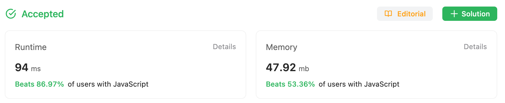
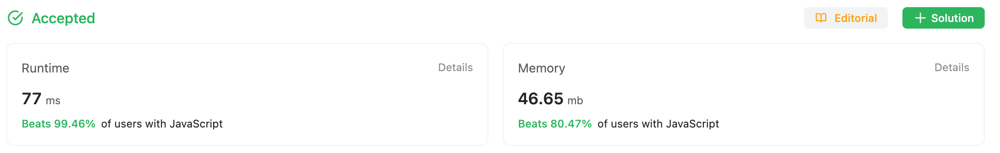

## Problem

https://leetcode.com/problems/median-of-two-sorted-arrays/submissions/

Given two sorted arrays `nums1` and `nums2` of size `s1` and `s2` respectively, return **the median** of the two sorted arrays.

The overall run time complexity should be `O(log (n))`.
where n = s1 + s2.

**Example 1:**

```
Input: nums1 = [1,3], nums2 = [2]
Output: 2.00000
Explanation: merged array = [1,2,3] and median is 2.
```

**Example 2:**

```
Input: nums1 = [1,2], nums2 = [3,4]
Output: 2.50000
Explanation: merged array = [1,2,3,4] and median is (2 + 3) / 2 = 2.5.
```


## Solution

### My Original Solution

```javascript
const findMedianSortedArrays = function(nums1, nums2) {
    let arr = [...nums1, ...nums2]
    arr = arr.sort((a, b) => a - b);

    const length = arr.length;
    if (length % 2 === 0) {
        const mid = length / 2;
        return (arr[mid - 1] + arr[mid]) / 2;
    } else {
        const mid = Math.floor(length / 2);
        return arr[mid];
    }
};
```

#### Time Complexity: $O(n*log(n))$

1. **Spread Operator(...)**: time complexity is $O(n)$.

2. **Sort**: Chrome uses Timsort for arrays with more than 10 elements, which has a worst-case time complexity of $O(n*log(n))$
3. **Overall**: the overall time complexity of the function is determined by the more costly operation, which is the sorting. $O(n*log(n))$



And, yes. There is much chance to improve solution.

### Improved Solution Using Binary Search

#### What is Binary Search

The algorithm checks the middle element to determine if it's greater than, less than, or equal to the value being searched for.

- If it's equal, you've found your value. 
- If it's less, you know the value must be in the upper half of the array. 
- If it's greater, the value must be in the lower half of the array. 

This process is repeated on the correct half of the array, essentially reducing the search space by half each time. This is why it's called a "binary" search. It's an efficient way to search for a value in a sorted array, with a time complexity of $O(log(n))$.

#### Full Code

```javascript
const findMedianSortedArrays = function(nums1, nums2) {
    if (nums1.length > nums2.length) {
        [nums1, nums2] = [nums2, nums1];
    }
    
    let x = nums1.length;
    let y = nums2.length;
    
    let start = 0;
    let end = x;
    
    while (start <= end) {
        let partitionX = (start + end) >> 1;
        let partitionY = ((x + y + 1) >> 1) - partitionX;
        
        let maxLeftX = (partitionX === 0) ? -Infinity : nums1[partitionX - 1];
        let minRightX = (partitionX === x) ? Infinity : nums1[partitionX];
        
        let maxLeftY = (partitionY === 0) ? -Infinity : nums2[partitionY - 1];
        let minRightY = (partitionY === y) ? Infinity : nums2[partitionY];
        
        if (maxLeftX <= minRightY && maxLeftY <= minRightX) {
            if ((x + y) & 1) {
                return Math.max(maxLeftX, maxLeftY);
            } else {
                return (Math.max(maxLeftX, maxLeftY) + Math.min(minRightX, minRightY)) / 2;
            }
        } else if (maxLeftX > minRightY) {
            end = partitionX - 1;
        } else {
            start = partitionX + 1;
        }
    }
};
```



### Solution Break Down

#### 1. Define Loop

```javascript
 while (start <= end) {
        let partitionX = (start + end) >> 1;
        let partitionY = ((x + y + 1) >> 1) - partitionX;
```

The binary search is performed in a `while` loop. The algorithm calculates `partitionX` and `partitionY` to divide `nums1` and `nums2` into left and right halves, respectively. The sum of the elements on the left side should be equal to or one more than the sum on the right side.

#### 2. Define maxLeft, maxRight for X and Y

```javascript
let maxLeftX = (partitionX === 0) ? -Infinity : nums1[partitionX - 1];
        let minRightX = (partitionX === x) ? Infinity : nums1[partitionX];
        
        let maxLeftY = (partitionY === 0) ? -Infinity : nums2[partitionY - 1];
        let minRightY = (partitionY === y) ? Infinity : nums2[partitionY];
```

The `maxLeftX`, `minRightX`, `maxLeftY`, and `minRightY` variables represent the border elements of the partitions in `nums1` and `nums2`. If a partition has no elements on the left or right side, it uses `-Infinity` or `Infinity`, respectively, to allow comparisons to be performed correctly.

#### 3. Check the partition

```javascript
if (maxLeftX <= minRightY && maxLeftY <= minRightX) {
```

Here, the algorithm checks whether the current partition is correct. It's correct if the largest element on the left side of the partition in `nums1` (`maxLeftX`) is not greater than the smallest element on the right side of the partition in `nums2` (`minRightY`), and the largest element on the left side of the partition in `nums2` (`maxLeftY`) is not greater than the smallest element on the right side of the partition in `nums1` (`minRightX`).

If this condition is met, it means all the elements on the left side of the partition are less than or equal to the elements on the right side, which is the property of a sorted array that the algorithm leverages to find the median.

#### 4. Return median

```ja
if ((x + y) & 1) {
    return Math.max(maxLeftX, maxLeftY);
} else {
    return (Math.max(maxLeftX, maxLeftY) + Math.min(minRightX, minRightY)) / 2;
}
```

Once the correct partition is found, the median is calculated and returned. If the total number of elements in `nums1` and `nums2` (`x + y`) is odd, the median is the maximum element on the left side of the partition. If the total number of elements is even, the median is the average of the maximum element on the left side and the minimum element on the right side.

#### 5. Adjust the search space

```javascr
} else if (maxLeftX > minRightY) {
    end = partitionX - 1;
} else {
    start = partitionX + 1;
}
```


## What I Learned: Binary Search

### Restrictions

Binary search can only be used when the array or list is sorted. 
If the data is not sorted, you would need to sort it first before using binary search, which can be expensive for large data sets.

### Benefits

1. **Efficiency**: Binary search has a time complexity of $O(log (n))$, making it much faster than linear search, which has a time complexity of $O(n)$ especially for large data sets.
2. **Less Comparisons**: In binary search, the number of comparisons decreases with each step, as the search space is halved. This reduces the total number of comparisons needed to find the target.
3. **Doesn't Require Extra Space**: Binary search doesn't require any extra space, as it works on the original data structure. This makes it a space-efficient algorithm.
4. **Versatility**: Binary search isn't just used for searching. It's also used in a variety of other algorithms and problem-solving approaches, including finding the square root of a number, checking if a number is a perfect square, and solving more complex problems like the median of two sorted arrays, as we've seen in this example.
