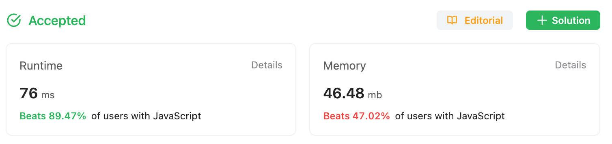

2023-08-03

## Problem

https://leetcode.com/problems/longest-palindromic-substring/

Given a string `s`, return *the longest* *palindromic substring* in `s`.

**Example 1:**

```
Input: s = "babad"
Output: "bab"
Explanation: "aba" is also a valid answer.
```

**Example 2:**

```
Input: s = "cbbd"
Output: "bb"
```

## Solution

### My Original Solution(Already Optimized)

#### Full Code

```javascript
const longestPalindrome = function(s) {
    let longest = '';

    function checkAround(idx_front, idx_rear){
        while (idx_front >= 0 && idx_rear < s.length && s[idx_front] === s[idx_rear]){
            idx_front -= 1;
            idx_rear += 1;
        }
        return s.slice(idx_front + 1, idx_rear)
    }
    function getCurrent(i){
        const current1 = checkAround(i, i);
        const current2 = checkAround(i, i+1);
        if (current1.length > current2.length){
            return current1;
        } else{
            return current2;
        }
    }

    for (let i = 0; i < s.length; i++){
        const current = getCurrent(i);
        if (longest.length < current.length){
            longest = current;
        }
    }
    return longest;
};
```



#### Break Down

Mainly, there are three parts.

**Main Loop**

```javascript
for (let i = 0; i < s.length; i++){
		const current = getCurrent(i);
  	if (longest.length < current.length){
    		longest = current;
    }
}
```

This is the main loop part. For each character, Look left and right, and get the longest palindromic substring around them.

**check 1 or 2**

```javascript
function getCurrent(i){
    const current1 = checkAround(i, i);
    const current2 = checkAround(i, i+1);
    if (current1.length > current2.length){
        return current1;
    } else{
        return current2;
    }
}
```

For example, Let's think about "baab" and "bab"
The center of the palindromic substring may be 1 character or 2 characters.

So, I both checked them.

**look left and right**

```javascript
function checkAround(idx_front, idx_rear){
    while (idx_front >= 0 && idx_rear < s.length && s[idx_front] === s[idx_rear]){
        idx_front -= 1;
        idx_rear += 1;
    }
    return s.slice(idx_front + 1, idx_rear)
}
```

Start with the current index, move forward and backward, and check if they're the same.
If they are not the same, stop.

But we have to 'undo' the last movement(idx_front -=1, idx_rear +=1). 
So I return the previous index.

```javascript
return s.slice(idx_front + 1, idx_rear)
```

### Calculate Time Complexity

I made ChatGPT to calculate complexity and It said:

1. The outer for loop: This iterates through each character in the string, meaning it has a time complexity of $O(n)$, where $n$ is the length of the string.
2. The `getCurrent` function: This function calls the `checkAround` function twice. The `checkAround` function can potentially iterate over the entire string in the worst case (when the entire string or a significant portion of it is a palindrome). Therefore, the `getCurrent` function has a worst-case time complexity of $O(2n) = O(n)$
3. Combining the above two: The outer loop runs for each character, and for each character, the `getCurrent` function is called. This leads to a combined time complexity of $O(n^2)$

