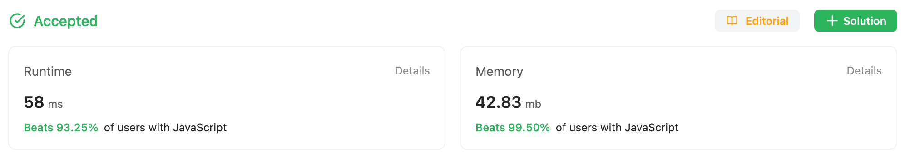
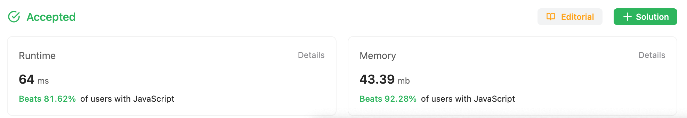

2023-08-06

## Problem

Given a signed 32-bit integer `x`, return `x` *with its digits reversed*. If reversing `x` causes the value to go outside the signed 32-bit integer range `[-231, 231 - 1]`, then return `0`.

**Assume the environment does not allow you to store 64-bit integers (signed or unsigned).** 

**Example 1:**

```
Input: x = 123
Output: 321
```

**Example 2:**

```
Input: x = -123
Output: -321
```

**Example 3:**

```
Input: x = 120
Output: 21
```

**Constraints:**

- `-231 <= x <= 231 - 1`

## Solution

### My Original Solution

```javascript
const reverse = function(x) {
    let output = 0;

    while(x !== 0){
        const last_digit = x % 10;

        output += last_digit;
        x -= last_digit;

        if (x !== 0){
            output = output * 10;
            x = x / 10
        }
    }

    if (output <= - 2147483648 || output >= 2147483647){
        return 0;
    }
    
    return output;
};
```



Well, I thought it was a straightforward question.
But I found this statement after I start writing this post.

`Assume the environment does not allow you to store 64-bit integers (signed or unsigned). `

Actually, a lot of 'upvoted' solutions failed to meet this condition :)

So, the solution should be like the one below.

### Solution - without 64-bit storing

```javascript
const reverse = function(x) {
    let output = 0;

    while(x !== 0){
        const last_digit = x % 10;

        output += last_digit;
        x -= last_digit;

        if (x !== 0){
          	if (output  <= (-2147483648 - x / 10) / 10 || 
              	output >= (2147483647 - x / 10)  / 10){
              return 0;
            }
            output = output * 10;
            x = x / 10
        }
    }
    
    return output;
};
```



## Complexity

ChatGPT calculated this for me:

### Time Complexity:

The time complexity is determined by how many times the loop is executed. Since the input x is divided by 10 in each iteration of the loop, the loop will run $log_{10}(∣x∣)$ times, where $|x|$ is the absolute value of $x$. Therefore, the time complexity is $O(log_{10}(|x|)$.

### Space Complexity:

The additional memory determines the space complexity the algorithm uses. In this case, the variables `output`, `last_digit`, and `x` all use a constant amount of space, regardless of the input size. Therefore, the space complexity is $O(1)$