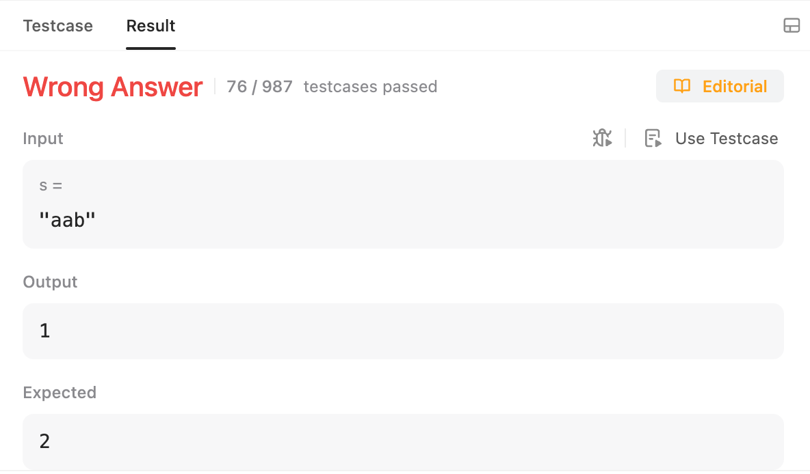

## Problem

https://leetcode.com/problems/longest-substring-without-repeating-characters/

Given a string `s`, find the length of the **longest** **substring** without repeating characters.

**Example 1:**

```
Input: s = "abcabcbb"
Output: 3
Explanation: The answer is "abc", with the length of 3.
```

**Example 2:**

```
Input: s = "bbbbb"
Output: 1
Explanation: The answer is "b", with the length of 1.
```

**Example 3:**

```
Input: s = "pwwkew"
Output: 3
Explanation: The answer is "wke", with the length of 3.
Notice that the answer must be a substring, "pwke" is a subsequence and not a substring.
```

**Constraints:**

- `0 <= s.length <= 5 * 104`

- `s` consists of English letters, digits, symbols, and spaces.

## Solve

### Attempt 1 (Failed)

#### My Solution

I tried not to loop more than once.
But I had to use the 'indexOf()' method, so the time complexity is still $O(n^2)$.

Here is the code I used:

```javascript
const lengthOfLongestSubstring = function (s) {
  let max = 0;
  for (let i = 0; i < s.length; i++) {
    const target = s[i];
    let len = s.indexOf(target, i + 1) - i;

    if (max < len) {
      max = len;
    }
  }
  if (max === 0) {
    return s.length;
  }
  return max;
};
```

This is what I thought:

1. Loop through characters and get the index of the next same character.
2. The number of characters between two same characters is calculated.
3. If no repeating characters are found, the length of 's' (input) is returned.

```javascript
if (max === 0) {
  return s.length;
}
```

I added the above because I met cases like " " and ""

#### Result

Unfortunately, my solution was incorrect.
My code failed in this simple case, Indicating that I need to revisit my approach.



### Attempt 2 (Sliding Window)

#### My Solution

I tried not to loop more than on
